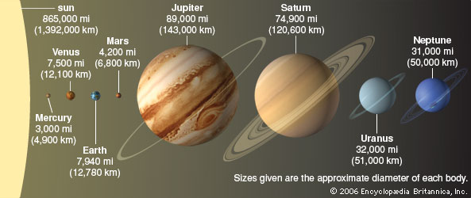
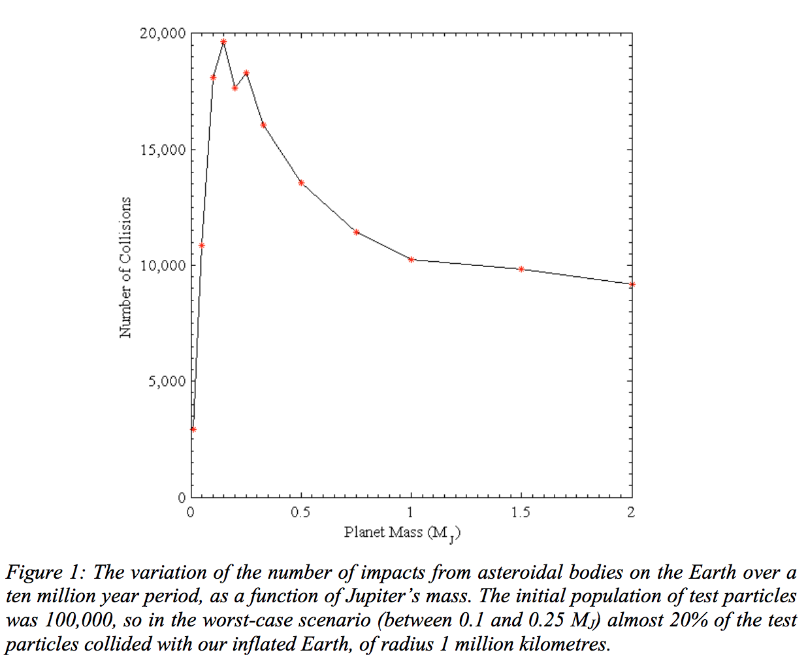

*(Submitted on 6 Feb 2012)*

**Is Jupiter Necessary for Life**

As it may appear the development of life on Earth, and Earth only in observable
universe has been a pure coincidence. Based on the commonly known theory of a
Big Bang, our planet seems to be the only lucky one to have perfect conditions
for the development of sentient life forms in the Milky Way galaxy. However, not
only the specific placement of Earth at a certain distance and specific angle
towards the Sun was the key factor in survivability of any forms of live that
took birth on its surface.

Scientists Jonathan Horner and Barrie W. Jones had finished a research,
indicating that not only Earth’s place in the line among other planets is
important, but also another celestial body: Jupiter, plays, perhaps, even more
valuable role in the existence of humanity.

The idea of a Jupiter being Earth’s friend is not new. And finally scientific
community was presented a detailed evidence that our giant neighbor not only
protected Earth for centuries from being bombarded with asteroids rains but also
has a particular influence of the planet by simply being placed on a delicately
calculated distance and angle towards the Earth to cause positive impact on both
protection of the planet and its thrive.

As a planet of huge size and specific electrical field and orbit, Jupiter is
showing the ability to affect the water movements on Earth. Especially, the
delivery of water from ice caps on the surface of our planet. As long as the
sophisticated balance in which our Solar System is existing and how delicate is
the process of development and preservation of sentient life forms on any
planet, it is important to understand the mechanisms behind the universe and how
and why Earth specifically became an only suitable habitat.

Original paper:. Accepted to appear in the peer-reviewed. Jonathan Horner 1,
Barrie W. Jones2 1 Department of Astrophysics and Optics, School of Physics,
University of New South Wales, Sydney 2052, Australia 2 Astronomy Discipline,
Department of Physics, Astronomy, and Space Science, The Open University, Milton
Keynes, MK7 6AA, United Kingdom

**Publication details**

| **Source**     | *Conference proceedings of the 11th annual Australian Space Science Conference, held in Canberra, September 2011*                                                                                                                                                                              |
|----------------|------------------------------------------------------------------------------------------------------------------------------------------------------------------------------------------------------------------------------------------------------------------------------------------------|
| **Title**      | **Quantifying Jupiter’s influence on the Earth’s impact flux: Implications for planetary habitability**                                                                                                                                                                                        |
| **Authors**    | Jonathan Horner1 , Barrie W. Jones2 1 Department of Astrophysics and Optics, School of Physics, University of New South Wales, Sydney 2052, Australia 2 Astronomy Discipline, Department of Physics, Astronomy, and Space Science, The Open University, Milton Keynes, MK7 6AA, United Kingdom |
| **Paper link** | <https://arxiv.org/abs/1202.1314>                                                                                                                                                                                                                                                              |

Matthew MacDonald

<Mastma0520@gmail.com>

Sample press release
