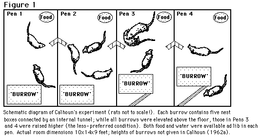

January, 2008

**Dangers of Overpopulation in “Social” Animals**

In 1947 John B. Calhoun built a closed environment to conduct a behavioral
experiment on Norwegian Rats, in order to understand and predict the possible
future of human society in the event of overgrowth of population.

The conditions of life for the rodents under the experiments consisted of
endless supply of food and water, territory big enough to accommodate 5000
animals and no threat of outside danger or diseases. Rats were supposed to be
thriving in an absolutely safe environment with everything that they may desire
for a happy life. Except for one thing: space.

Not surprisingly, in 2 years of monitoring the so-called “rat paradise” soon
became “rat hell”. Because of the artificial nature of the environment regular
rats were placed in, their life and reproductive cycle became completely
disrupted. That resolved in rodents developing deviations in their behavior like
over-aggressiveness, refusal to procreate, and performing any other activities
regular wild rats are so commonly known for. In spite of baby boom that animals
experienced at first in their new safe and satisfying “rat city” the population
in the end never exceeded 200 subjects. The distorted behavior stopped rats from
procreating, which resolved in the drastic drop of population and constant
fights between already-existing animals. Even after population significantly
decreased, rodents didn’t drop off previously developed habits and slowly the
“paradise” became a graveyard.

Calhoun’s experiment quickly became one of the most famous animal-related
sociological and psychological experiments in known science history along with
Pavlov’s dog and Skinner’s pigeons. The value of this experiment to
psychological and social behavior studies was hard to overestimate. This example
of changes in social behavior based on overpopulation in limited environment
under the conditions of satisfactory of all basic needs, is a great display of
what potential dangers can a human society face as it is progressing. And what
may become the cost of a comfortable and “luxurious” life humanity is aiming
for.

Original paper:

Working Papers on The Nature of Evidence: How Well Do ‘Facts’ Travel? No. 23/08
Escaping the Laboratory: The Rodent Experiments of John B. Calhoun & Their
Cultural Influence Edmund Ramsden & Jon Adams January 2008

| **Journal**    | *The Journal of Social History*                                                                   |
|----------------|---------------------------------------------------------------------------------------------------|
| **Title**      | **Escaping the Laboratory: The Rodent Experiments of John B. Calhoun & Their Cultural Influence** |
| **Authors**    | **Edmund Ramdsen & Jon Adams**                                                                    |
| **Paper link** | <https://eprints.lse.ac.uk/22514/1/2308Ramadams.pdf>                                              |

Matthew MacDonald

<Mastma0520@gmail.com>

Sample article
