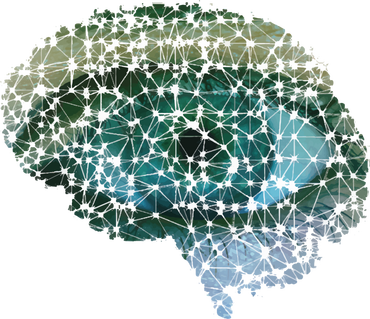
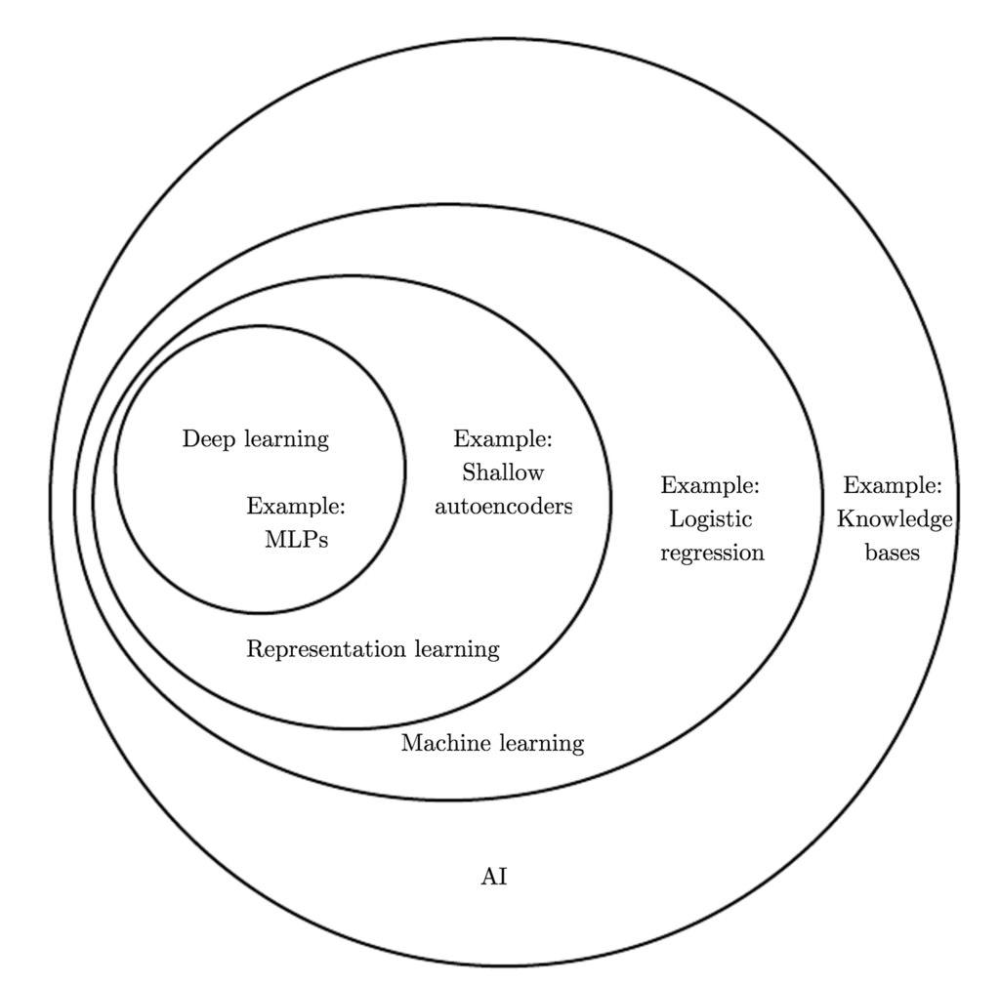

Deep Learning, and How Everything I thought I Knew Was Wrong

Matthew MacDonald, December 26, 2018

Preconceptions

A few days ago, I would have told you that deep learning and machine learning
were identical. I wouldn’t have even needed a Google search to say that. But
that very preconceived notion of understanding was the foundation for my error.

Asking a number of associates and friends, I received answers varying from
“*some type of AI,” “black box”, “deep, focused learning,” “something computers
do”, “math stuff,” and “AI that learns”.* Some being jokes, some being serious
answers, I realized the heart of the issue lay in the popularity of the
terminology in media and its fundamental misunderstanding of most technology and
science. It was less about how we understand and more about how we inform
ourselves.

The “God Particle”

A lot was made in the media trying to understand the concept of the Higgs-Boson.
Fundamentally, it was an extremely difficult concept to explain without a
background in physics. If you went throwing terms like “a field which imparts
mass upon quantized particles” and “the basics of scalar fields” to the average
citizen, they would likely throw up their hands and stop reading or listening.
However, in a desire to make the topic sexier, the media decided that the
Higgs-Boson was the “God Particle” and proceeded to give third-grade
explanations to a public that deserved better. Richard P. Feynman, the Great
Explainer is quoted as saying “*I couldn’t reduce it to the freshman level. That
means we don’t really understand it*.”

I had become comfortable in the concept of knowing my technical terms too well,
and relied on popular tech blogs explanations of a topic I was only tangentially
familiar with, in the subcategory of AI.

Subset of a Subset

Artificial intelligence is a very wide-ranging topic that could apply to a great
many fields of engineering and even philosophy. Taken as a set in itself,
machine learning is a subset of that. And deep learning is a subset within that
subset. Even saying this, I am oversimplifying a topic I do not fully understand
on an on-the-ground level.

The major GPU manufacturer NVidia states, “Deep Learning is a subset of AI and
machine learning that uses multi-layered artificial neural networks to deliver
state-of-the-art accuracy in tasks such as object detection, speech recognition,
language translation, and others.”

What defines deep learning is better what it does *not* do rather than what it
does. Deep Learning is not attempting to realize AI. It is a component of AI.
One example of its abilities is to harness specific datasets like large volumes
of images to make pattern recognitions based upon that. When you use Google
Photos to search for “mountains”, and it manages to pull a good many of your
hiking photos out successfully, that is deep learning in practice. Google is
harnessing the immense dataset of all of the pictures in the world that people
have put onto Google Photos, in addition with its existing image library, and
determining with a certain level of “accuracy” which photos it thinks are
mountains, and which ones are not “a mountain of fries”, a dish popular at a
small diner in Gunma, Japan I once went to many years ago. Though in all
fairness, it did recognize the fries as a mountain. Now I wonder -- did it know
something I didn’t tell it? Even with huge datasets, computers can have
pareidolia.

Ground Truth

In the end, Deep Learning is just a link in the chain of AI, used to make
determinations in things as varied as image and video recognition, natural
language processing, fraud detection, and even sentiment analysis of text. For
this, it requires two things: large labeled datasets and lots of computational
power, usually facilitated by GPU processing.

When autonomous driving is a real thing, it will be necessary to determine the
difference between a cyclist and a motorcyclist. It will be relied upon for
continuous, accurate determination of things we take for granted. And we, with
the most advanced “neural networks” on the planet, still make plenty of errors
with our “hardware”.

Ever improving, ever developing, as computers become more powerful and datasets
larger, Deep Learning is an absolutely necessary component in turning the real
world into useful information to assist us in the tasks that become ever more
mundane in our phones, security devices, cars, and entertainment.

So tell Alexa “thanks” for me.
